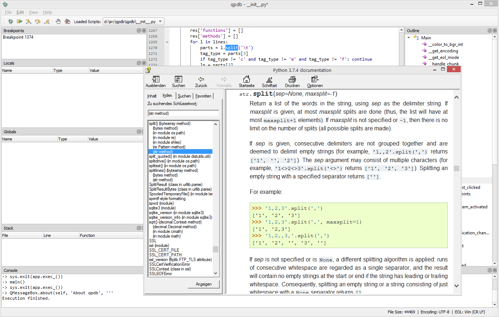

# qpdb
A simple graphical Python debugger and code editor based on pdb, PyQt5 and Scintilla

**Requirements**

pip install PyQt5 QScintilla

**Usage**

* python -m qpdb
* python -m qpdb /path/to/foo.php
* python -m qpdb /path/to/foo.php /path/to/bar.php ...

**Features**

* One or multiple scripts can be loaded, either by:
    * passing it/them as commandline arguments
    * loading it/them via menu->File->Load...
    * dropping it/them into the application window
* If multiple files are loaded, you can use a combobox in the toolbar to switch between them and then add breakpoints
* You can add/remove breakpoints either by toolbar button or by clicking into column on the right of the linenumbers
* Current breakpoints are listed in the "Breakpoints" pane, clicking on a breakpont jumps to the corresponding code line
* Simple data types (str, int, float, bool) can be edited at runtime in the "Locals"/"Globals" panes
* You can jump to stack frames by clicking on the corresponding line in the "Stack" pane
* Comment (Alt+C)/uncomment (Alt+U) current code selection
* Click-sensitive "Outline" pane showing classes, methods and top-level functions
* Context-sensitive help, arbitrary CHM help files can be integrated, as well as Qt Assistant

**Screenshots**

* qpdb debugging its own script:

  

* Autocomplete:

  

* Calltip:

  

* Context-sensitive help:

  
